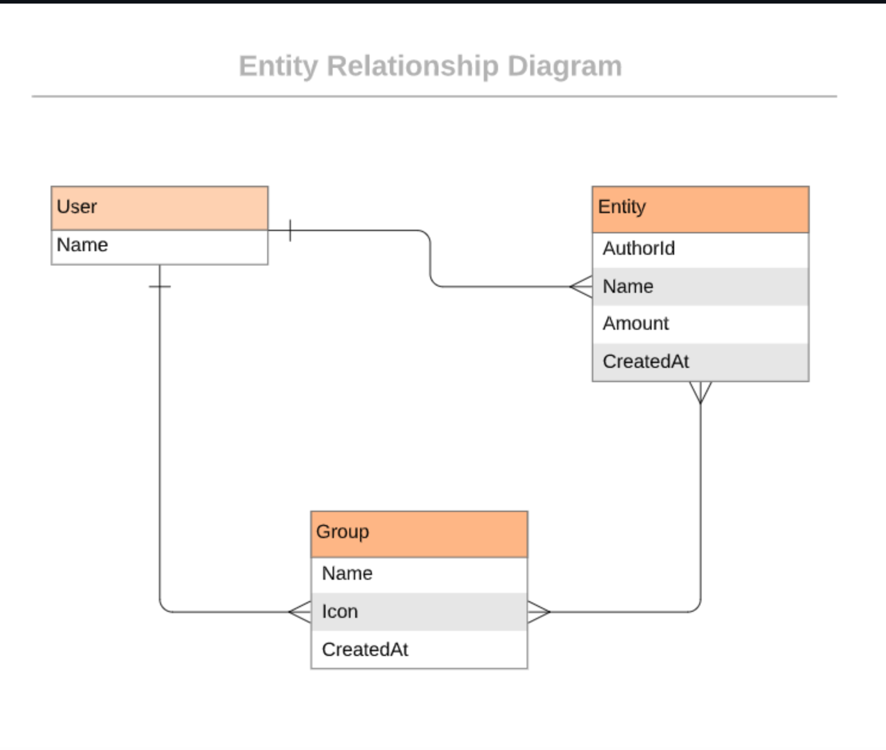

# README

 

# Budget-App
This a mobile web application where you can manage your budget and have a list of transactions associated with a category, so that you can see how much money you spent and on what. It follows [design](https://www.behance.net/gallery/19759151/Snapscan-iOs-design-and-branding?tracking_source=) idea by [Gregoire Vella on Behance](https://www.behance.net/gregoirevella).

# Sneak Peek

## Built With
- Language: Ruby
- Frameworks: Ruby on Rails
- Testing: 
     - Unit : RSpec
     - Integration : Capybara
- IDE : vscode
- Database : PostgressSQL
- Template engine .erb
- Linters:
     - CSS: Stylelint
     - Ruby: Rubocop

## Entity relationship diagram for DB

# Live Demo of Budget App

## Getting Started

- Check the Ruby version or if you  have one  by running `ruby -v` if you get something like this `ruby 2.6.8p205 (2021-07-07 revision 67951)` you have Ruby installed.
- Clone the repository by runiing  ssh: `gh repo clone Eternalgratis/Budget-app` or http:`https://github.com/Eternalgratis/Budget-app.git` in your CLI.
- `cd Budget-app`
- Run `bundle install`
- Run `rails db:create db:migrate`
- Run `rails server`
- Open Browser `http://localhost:3000/`

## Testing
- Run `rspec`

👤 **Apuabi Titilope**

- GitHub: [@Eternalgratis](https://github.com/Eternalgratis)
- Twitter: [@eternalgratis](https://twitter.com/eternalgratis)
- LinkedIn: [Apuabi Titilope](https://www.linkedin.com/in/titilope-apuabi/)

## 🤝 Contributing

Contributions, issues, and feature requests are welcome!

Feel free to check the [issues page](https://github.com/Eternalgratis/Budget-app/issues).

## Show your support

Give a ⭐️ if you like this project!

## Acknowledgments

- Microverse
- Original [design](https://www.behance.net/gallery/19759151/Snapscan-iOs-design-and-branding?tracking_source=) idea by [Gregoire Vella on Behance](https://www.behance.net/gregoirevella)

## 📝 License

This project is [MIT](./MIT.md) licensed.